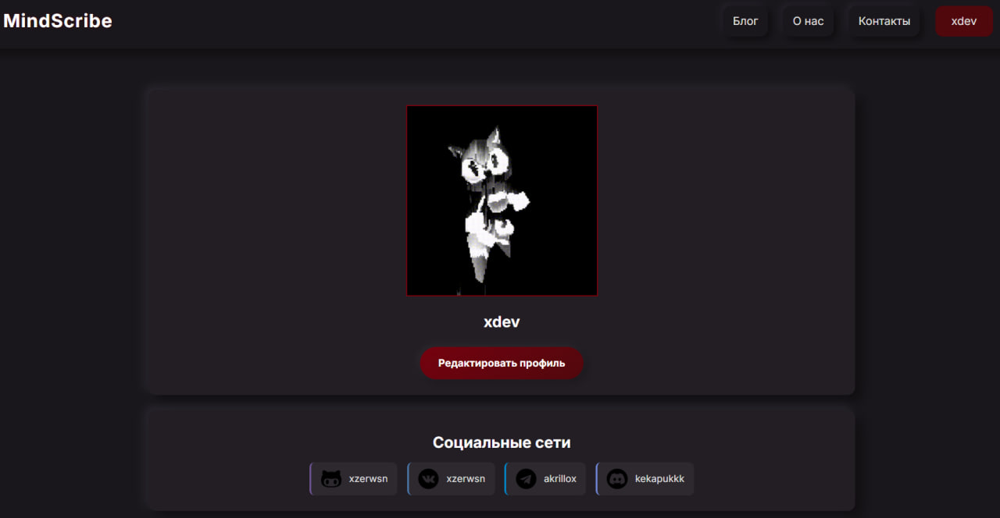

# MindScribe

MindScribe - это приложение для создания и ведения заметок, предназначенное для улучшения управления мыслями и организации идей.

## Оглавление
- [Описание](#описание)
- [Преимущества](#преимущества)
- [Как запустить проект](#как-запустить-проект)

## Описание

MindScribe помогает пользователям записывать, хранить и организовывать свои заметки и идеи в удобной форме. Благодаря интуитивно понятному интерфейсу, пользователи могут легко добавлять заметки, создавать категории и придавать своим мыслям структуру.

## Преимущества

- **Простой интерфейс**: Приложение доступно и легко воспринимается пользователями всех уровней.
- **Организация мыслей**: Позволяет структурировать идеи, что упрощает доступ к ним.
- **Креативность**: Способы визуализации мыслей помогут раскрыть полный потенциал вашего воображения и креативного мышления.

## Как запустить проект

1. **Клонируйте репозиторий**:
git clone https://github.com/xzerwsn/mindscribe.git

2. **Перейдите в папку проекта**:
cd mindscribe

3. **Установите зависимости** (если требуется):
npm install

4. **Запустите приложение**:
npm start

Теперь вы готовы использовать MindScribe!

MindScribe - A Place Where Thoughts Take Shape
Welcome to MindScribe! This project is designed to help users transform their thoughts into written form, facilitating the writing process and creative thinking.

##Why Use MindScribe?
- **User-Friendly**: The simplicity of the interface makes note creation easy and intuitive.
- **Thought Organization**: It allows you to structure your ideas, making them accessible and organized.
- **Creativity**: Methods for visualizing thoughts will help you unlock the full potential of your imagination and creative thinking.
- 
##How to Run the Project

1. **Clone the Repository**:
   
  First, clone this repository to your local machine with the following command:
    git clone https://github.com/xzerwsn/mindscribe.git
   
2. **Navigate to the Project Directory**:
    cd mindscribe
   
3. **Install Dependencies**:
    npm install
  
4. **Run the Application**:
   npm start
   
Now you're ready to use MindScribe!
